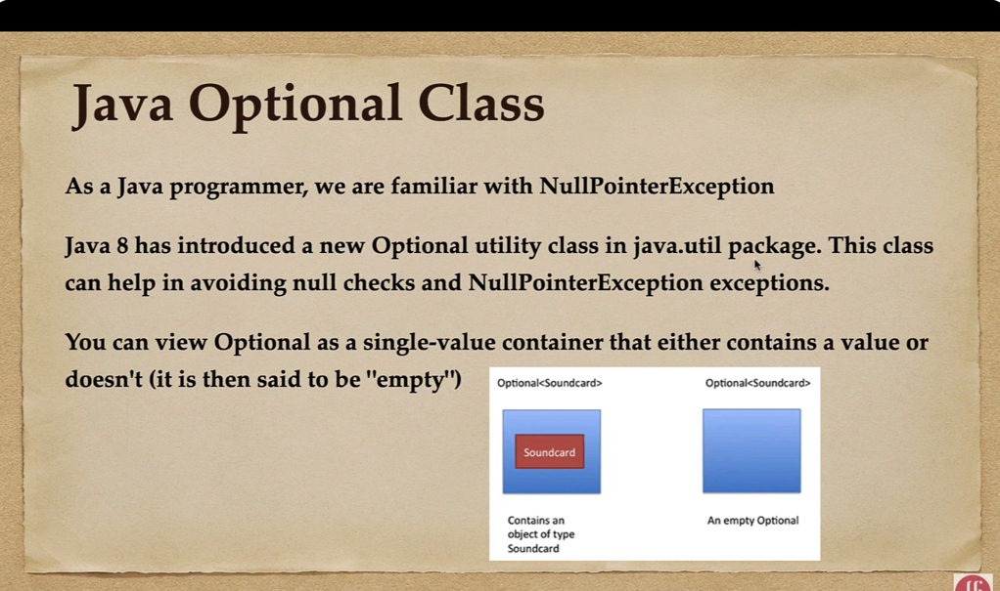

can contain multiple default concrete methods or static methods


### **Java Method References :** 




if we need to add another method to a functional interface, adding abstract method wont be possible.
thats why it gives facility to add a concrete default method.

## **Stream API :**


flatMap(list -> list.stream())
You're right — this flattens the nested structure into a single stream:

Great question, Shilpa! Let's break it down clearly.

---

## 🔀 What is a **Parallel Stream** in Java?

A **Parallel Stream** is a feature in Java Streams that allows **processing elements concurrently**, using **multiple threads** instead of a single one — improving performance for large datasets.

### 🚀 How it works:
- Java uses the **Fork/Join framework** behind the scenes.
- The data is **split** into chunks.
- Each chunk is processed **in parallel** (across multiple CPU cores).
- The results are **combined** automatically.

---

## 🆚 Sequential vs Parallel Stream

| Feature              | Sequential Stream                     | Parallel Stream                         |
|----------------------|----------------------------------------|------------------------------------------|
| Threads              | Single-threaded                        | Multi-threaded (uses common ForkJoinPool)|
| Performance          | Slower for large data                  | Faster for large, independent data       |
| Order                | Maintains processing order             | Order not guaranteed (unless forced)     |
| Use case             | Small to medium-sized data             | Large data, CPU-bound tasks              |

---

## ✅ Example:

### 🔹 Sequential Stream
```java
list.stream()
    .filter(s -> s.startsWith("a"))
    .forEach(System.out::println);
```

### 🔹 Parallel Stream
```java
list.parallelStream()
    .filter(s -> s.startsWith("a"))
    .forEach(System.out::println); // Order not guaranteed
```

---

## ⚠️ When **NOT** to use `parallelStream()`:
- When you need **ordered** results (`forEachOrdered` can help but defeats parallelism).
- For **small datasets** (overhead > benefit).
- When operations are **not thread-safe**.
- When there's **shared mutable state** (risk of race conditions).

---

## 🧠 Tips:
- Use `parallelStream()` **only when**:
    - The dataset is **large**.
    - The operations are **independent** and **CPU-intensive**.
- For better control, consider using **`ForkJoinPool`** directly in advanced cases.

---

Let me know if you want to try an example where we compare the time taken by sequential vs parallel processing!


